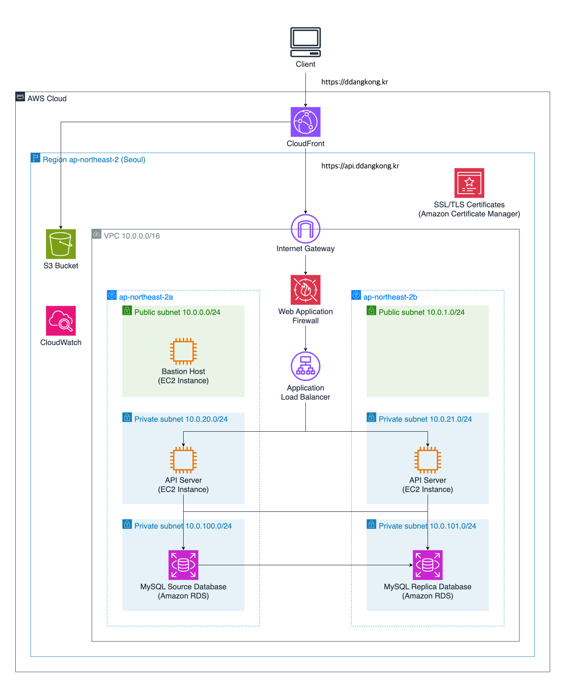
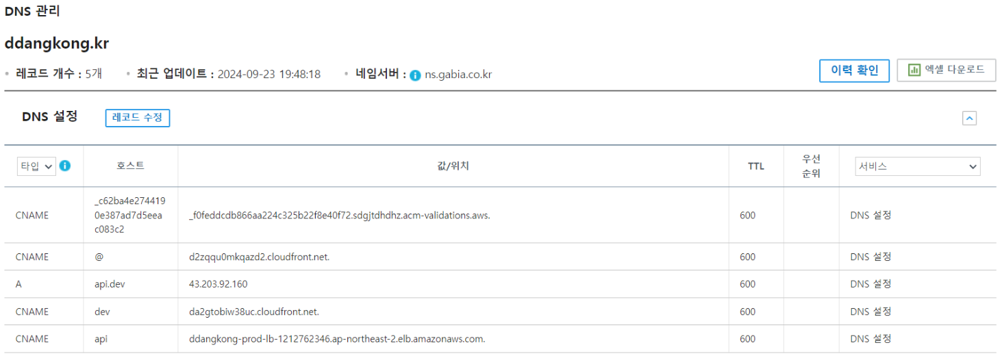

# 땅콩 팀 인프라 소개 및 설정 방법 공유

## 목차

- 전반적인 인프라 소개
- 가비아를 통한 DNS 설정
- 프론트엔드 인프라 구조
- 백엔드 인프라 구조
- 기타
- 참고 자료

## 전반적인 인프라 소개

- 프론트 구성
  - 정적 파일을 관리 (모든 유저에게 똑같이 보여주는 파일)
  - S3, CloudFront를 이용함

- 백엔드 구성
  - 동적 로직을 관리
  - ELB, EC2, RDS를 사용
  - 네트워크 분리를 위해 VPC와 Subnet을 사용 (글 분량에 따라 언급)

- 기타 (글 분량에 따라 언급)
  - WAF
  - CloudWatch

## 가비아를 통한 DNS 설정

- DNS란?
  - 사람이 읽을 수 있는 도메인 이름(예: ddangkong.kr)을 머신이 읽을 수 있는 IP 주소(예: 192.0.2.44)로 변환하는 서버
  - 사람이 인지하기 쉬운 영어를 통해서 숫자 4개로 되어있는 서버 주소로 들어갈 수 있도록 함
  - IP 주소가 바뀌더라도 도메인 이름만을 알고 있다면, 언제든지 같은 서비스에 접속할 수 있다.

- 가비아란
  - 가비아는 IT 환경을 필요로 하는 기업을 대상으로 클라우드, 그룹웨어, 보안, 도메인, 호스팅에 이르는 통합적인 인프라 서비스를 제공하는 기업이다.
  - 도메인, 웹호스팅, 홈페이지 서비스에서 나아가 자체 기술 스텍으로 개발한 IaaS(Infrastructure-as-a-Service) ‘g클라우드’와 클라우드 운영에 꼭 필요한 전반의 서비스를 제공하는 ‘매니지드 서비스’, 클라우드 기반 메일/그룹웨어 ‘하이웍스’ 등 끊임없는 연구 개발로 IT플랫폼으로서 고객의 비즈니스 성장을 돕고 있다.
  - 우리 서비스에서는 도메인 구매 및 DNS 설정을 위해 해당 서비스를 사용했다.

### 레코드의 종류

- A: 특정 도메인 이름을 IP 주소에 매핑하는 DNS 레코드
  - 작동 방식: 사용자가 웹 브라우저에 example.com을 입력하면, DNS 서버는 A 레코드를 참조하여 해당 도메인을 192.0.2.1 IP 주소로 변환하고, 그 IP 주소로 트래픽을 라우팅한다.
  - api.dev의 경우 ~

- CNAME: 하나의 도메인 이름을 다른 도메인 이름으로 매핑하는 DNS 레코드
  - 작동 방식: CNAME 레코드는 다른 도메인의 별칭(Alias)을 정의하는 데 사용된다. 예를 들어, www.example.com을 example.com으로 리디렉션하고자 할 때 CNAME 레코드를 사용한다.
  - 즉, www.example.com으로 요청이 오면 DNS 서버는 이를 example.com으로 변환하고, 그 후에 example.com에 대한 A 레코드 등을 참조하여 최종 IP 주소로 연결된다.
  - `@`는 ...

- 기타 레코드 종류
  - **AAAA 레코드** : 도메인 이름을 **IPv6 주소**로 매핑
  - **MX 레코드 (Mail Exchange Record)** : 이메일을 수신할 메일 서버를 지정
  - **TXT 레코드 (Text Record)**: 도메인에 대한 추가적인 텍스트 정보를 제공 (주로 인증 및 정책 정보를 저장)
  - **NS 레코드 (Name Server Record)** : 도메인을 관리하는 네임서버를 지정합니다.
  - **SOA 레코드 (Start of Authority Record)** : 도메인에 대한 권한이 있는 네임서버와 관련된 정보를 제공 (일반적으로 도메인의 관리 정보와 리프레시 타임, 재시도 타임 등을 포함)

### DNS 설정

- DNS 설정 방법
  1. [가비아 메인 화면](https://www.gabia.com/)으로 이동
  2. Gmail 땅콩 계정으로 로그인
  3. My가비아 > 이용 중인 서비스 > 도메인 으로 이동
  4. ddangkong.kr의 관리 버튼 클릭하여 ddangkong.kr의 도메인 관리 페이지로 이동
  5. 하단의 DNS 정보 > 도메인 연결 > 설정 버튼을 클릭하여 DNS 관리 페이지로 이동
  6. ddangkong.kr의 DNS 정보 > 설정 버튼을 클릭하여 ddangkong.kr의 DNS 관리 페이지로 이동

- 현재 설정 (24.10.01 기준)
  

- prod 관련 도메인 설정
  - @ : ddangkong.kr로 연결된 값되는 주소를 의미합니다. prod 환경으로 구현된 프론트 CloudFront에 접근하는 주소입니다.
  - api : api.ddangkong.kr로 연결되는 주소를 의미합니다. WAS와 연결되어 있는 ELB의 주소와 연결되어 있습니다.
- dev 구조
  - dev : dev.ddangkong.kr 에서 연결되는 주소를 의미합니다. dev 환경의 프론트 CloudFront에 접근하는 주소입니다.
  - api.dev : api.dev.ddangkong.kr 에서 연결되는 주소를 의미합니다. WAS의 public ip가 입력되어 있습니다.

## 프론트엔드 인프라 구조

### S3 (Amazon Simple Storage Service)

- S3란?
  - 어디서나 원하는 양의 데이터를 저장하고 검색할 수 있도록 구축된 객체 스토리지
- 특징
  - 업계 최고 수준의 내구성, 가용성, 성능, 보안 및 거의 무제한의 확장성을 아주 저렴한 요금으로 제공하는 단순한 스토리지 서비스
  - 언제든지 어디서나 원하는 양의 데이터를 저장하고 검색하는 데 사용할 수 있는 간편한 웹 서비스 인터페이스를 제공

- 우리 서비스에서 S3를 사용하는 이유
  - S3는 정적 웹사이트를 직접 호스팅할 수 있는 기능을 제공합니다. React 애플리케이션은 주로 HTML, CSS, JavaScript로 구성된 정적 파일이므로 별도의 서버 없이도 S3만으로 호스팅이 가능합니다.
  - S3는 사용한 만큼만 비용을 지불하는 구조로, 초기 비용 부담 없이 작은 프로젝트부터 큰 프로젝트까지 확장할 수 있습니다. React로 만든 정적 사이트는 서버 사이드 로직이 없기 때문에 비용 효율성이 매우 높습니다.
  - S3는 Amazon Web Services(AWS)의 글로벌 인프라를 사용하여 대규모 트래픽을 처리할 수 있습니다. 사용자가 갑자기 늘어나더라도 추가 설정 없이 트래픽을 자동으로 처리할 수 있습니다.
  -
- 설정 방법
  - 

### CloudFront

- CloudFront란
  - 
- 특징
  - S3는 Amazon CloudFront와 쉽게 연동되어 글로벌 사용자에게 빠른 콘텐츠 전달이 가능합니다. CloudFront를 사용하면 전 세계의 사용자에게 빠르고 안정적인 성능을 제공할 수 있어 React 애플리케이션의 사용자 경험이 향상됩니다.
  -

- 우리 서비스에서 CloudFront를 사용하는 이유
  - 
- (설정 방법)
  - 

## 백엔드 인프라 구조

### ELB (Elastic Load Balancing)

- ELB란?
  - 하나 이상의 가용 영역(AZ)에 있는 여러 대상 및 가상 어플라이언스에서 들어오는 애플리케이션 트래픽을 자동으로 분산하는 서비스
- 특징
  - 

- 우리 서비스가 ELB를 사용하는 이유
  - 
- (설정 방법)
  - 

###  EC2 (Amazon Elastic Compute Cloud)

- EC2란?
  - 클라우드에서 온디맨드 확장 가능 컴퓨팅 용량을 제공하는 서비스
- 특징
  - 

- 우리 서비스가 EC2를 사용하는 이유
  - 
- EC2의 설정들
  - 
- 설정 방법
  - 

### RDS (Amazon Realtional Database Service)

- 클라우드에서 간편하게 데이터베이스를 설치, 운영 및 규모 조정할 수 있는 관리형 서비스

## 기타

### WAF (AWS Web Application Firewall)

- 객이 정의한 조건에 따라 웹 요청을 허용, 차단 또는 모니터링(계수)하는 규칙을 구성하여 공격으로부터 웹 애플리케이션을 보호하는 웹 애플리케이션 방화벽
- IP 주소, HTTP 헤더, HTTP 본문, URI 문자열, SQL 명령어 주입 및 교차 사이트 스크립팅이 포함됩니다.

### CloudWatch

- CloudWatch란?
  - AWS 리소스 전반의 데이터를 수집하여 전체 시스템의 성능을 파악할 수 있도록 하고, 사용자가 경보를 설정하고, 변화에 자동으로 대응하고, 운영 상태에 대한 통합된 뷰를 볼 수 있도록 한다.

- 로그 설정 방법 (24.10.01 기준)
  - EC2에서 로그 전송 방법

- Ddangkong의 로그 확인 방법
  1. ㄱ
  2. ㄴ
  3. ㄷ
  4. ㄹ
  5. 

## 참고 자료

- [DNS란 무엇입니까?](https://aws.amazon.com/ko/route53/what-is-dns/) (검색 일자 : 24.10.01)
- [가비아 회사 소개](https://company.gabia.com/introduce/corporate) (검색 일자 : 24.10.01)
- [AWS WAF FAQ](https://aws.amazon.com/ko/waf/faq/) (검색 일자 : 24.10.01)
